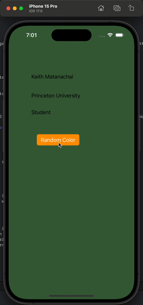

# Prework - BACKGROUND CHANGER

Submitted by: Keith Matanachai

Background changer is an app that changes the background of the app to a random color everytime the Change button is pressed 

Time spent: 1 hours spent in total

## Required Features

The following **required** functionality is completed:

- [x] Users are see a screen with three labels and a button
- [x] Tapping the button changes the screen color to a random color
 
## Video Walkthrough

## App Brainstorming (Step 4)

- Notion
    - Cross platform capability
    - Flexibility with blocks and customization
- Day One
    - Map feature to see where I did my journaling and where my photos were taken
    - Streaks feature to keep me motivated to journal everyday
- Spotify
    - Recommendation systems for music
    - offline download
    
App Idea:

Function: efficient and fun learning through mindmapping

- CRUD on nodes and edges
- Aided reorganization of relationships
- Aided scaffolding of a topic
- Asking of pointed relational questions for testing and retrieval of knowledge
- Quick link by clicking on nodes to search online or search about relationship online
- Apple pencil drawing support
- Sync between devices

## Notes

n/a

## License

    Copyright 2023 Keith Matanachai

    Licensed under the Apache License, Version 2.0 (the "License");
    you may not use this file except in compliance with the License.
    You may obtain a copy of the License at

        http://www.apache.org/licenses/LICENSE-2.0

    Unless required by applicable law or agreed to in writing, software
    distributed under the License is distributed on an "AS IS" BASIS,
    WITHOUT WARRANTIES OR CONDITIONS OF ANY KIND, either express or implied.
    See the License for the specific language governing permissions and
    limitations under the License.
